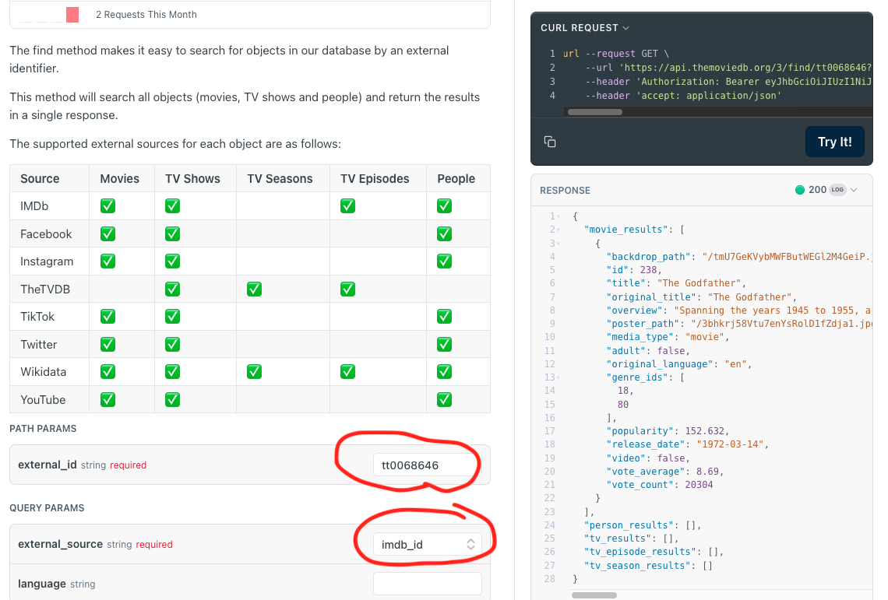

<br/>


# Reading data from a Rest API into DTOs

In this exercise we want to read data from a Rest API and map it to DTOs. We will use the [The Movie Database API - TMDb](https://developer.themoviedb.org/reference/intro/getting-started) to fetch information about movies. We will then map the data to DTOs. And finally, we will add some functionality to operate on the DTOs.

## API Data Retrieval from the TMDB web-interface (the easy way)

First, let's get familiar with the TMDB API. We will use the web interface to get data from the API. This is the easiest way to get started.

1. Create an account a TMDB. Use [this link to sign up](https://www.themoviedb.org/signup). Now you acn login in and get an API key.

2. Get an API key from TMDB. Use [this link to get an API key](https://www.themoviedb.org/settings/api). When you fill out the form you can be inspired by this: <br/><br/> 

3. Now you have an API key. You can use it to fetch data from the TMDB API. You can use the following URL in your favourite browser to get a list of movies:

    ```plaintext
    https://api.themoviedb.org/3/movie/popular?api_key=YOUR_API
    ```

    It should look like this (but with your API key - this one won't work):

    ```plaintext
    https://api.themoviedb.org/3/movie/popular?api_key=9d7597515aa9bc499ea280f761379de1
    ```

3. You will probably be familiar with IMDB for movies. <br/><br/> <br/><br/>
You can also find info on movies from IMDB through TMDB. Try this: Request the movie details using the **IMDB** `ID` of each movie. See more [here](https://developer.themoviedb.org/reference/find-by-id). Let's aquire data for the [Godfather movie at IMDB](https://www.imdb.com/title/tt0068646). You might check this screenshot to how you configure and run the request from within the themoviedb.org page:<br/><br/>


4. Now use the *TMDB API* to retrieve detailed information about movies based on their `titles` instead of `ID`. Begin by fetching the details for the movie `Godzilla` throught the web interface of TMDB and then contruct a url to insert in your browser including your api-key. This is just to get familiar with the API and how to use it. Look carefully at the json response and try to understand the structure of the data. Notice there are many fields in the response. We will only use a few of them. Also, since several movies are spinoffs of the original Godzilla movie, you might want to use the `release_year` field to filter the results or notice the `ID` of the movie you are looking for (try with 1954).

## Getting data from the API programmatically in Java <br/>

(the slightly harder - but cooler and more useful way)

Now the fun begins. We will use Java to fetch data from the `TMDB API`. We will use the [`HttpClient`](../../toolbox/dataintegration/httpclient.md) class to make the requests. We will also use the `ObjectMapper` class from the [Jackson library](../../toolbox/dataintegration/jackson.md) to [map]((../../toolbox/dataintegration/dto_conversion.md)) the [JSON](../../toolbox/dataintegration/json.md) response to [DTOs](../../toolbox/designpatterns/dto.md).

The plan is to fetch some moviedata from the TMDB API and map it to a MovieDTO. We will then add some functionality that can operate on the MovieDTOs.

1. Get the Movie `overview` from the API response (for a particular `ID`) and add it to a properly designed MovieDTO.

2. Get the release date from the API response and add it to the MovieDTO (as a `LocalDate`) and leave the release year as a `String`.

3. **Adding functionality**

Add a new class `MovieService` with the following methods:

- `getByRating` that can take a rating or similar as a parameter and return all movies with that rating or lower or if you prefer, use the quality rating and find all movies with a specific rating e.g 8.5 and higher. You will need to return the movies in a List of MovieDTOs.

- `getSortedByReleaseDate` that takes a query string and returns all movies sorted by release date descending.

- Write unit/integration tests for the `MovieService` where you search for the following titles tests the result agains the expected out result. Make a strategy for how to test the methods in the MovieService class:

  - The Shawshank Redemption
  - The Godfather
  - The Dark Knight
  - The Godfather: Part II
  - The Lord of the Rings: The Return of the King
  - Pulp Fiction
  - 12 Angry Men
  - The Good, the Bad and the Ugly
  - Forrest Gump
  - Fight Club
  - Inception

- Then test the other method in the `MovieService` class.

4. **Extra**

- Add a methods to the `MovieService` that you find useful.
