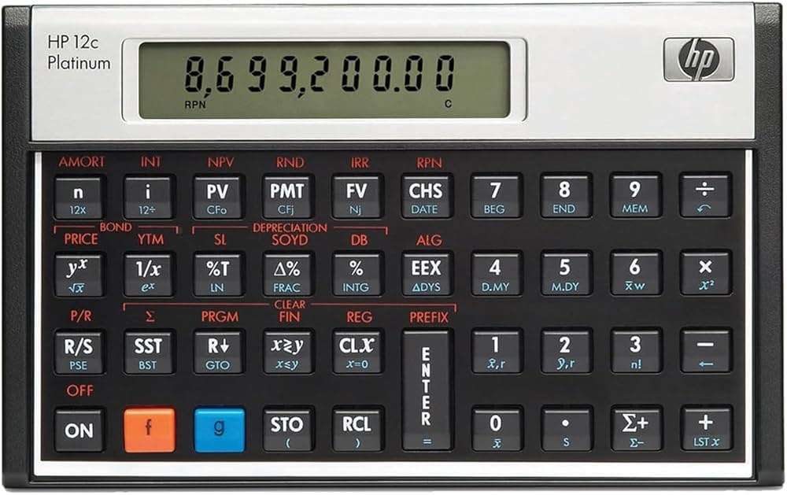

# Codelab Exercise 2: Implementing Reverse Polish Notation in JavaScript

In the [calculator exercise](./Calculator.md), we used the Javascript `eval()` method. It's far from a perfect solution, and in this exercise we will take the first steps to a better way. We will explore **Reverse Polish Notation (RPN)**, a postfix notation that eliminates the need for parentheses and respects operator precedence implicitly. RPN is used in many programming languages and calculators because of its simplicity and efficiency.

The famous HP calculators use RPN. If you have never used one, you should try it. It's a different way of thinking about calculations. This one from 1981 is a beauty, and you can still buy them today.:



Notice that there is not an equal sign on the calculator. You just type in the numbers, press Enter, and the operators, and the result is shown immediately. This is because the calculator uses RPN.

- This article describes both [`infix` and `postfix` notations](https://www.geeksforgeeks.org/infix-postfix-prefix-notation/).

## **Objective**

- Understand how Reverse Polish Notation (RPN) works and why it’s useful.
- Implement a JavaScript algorithm that evaluates expressions in RPN format.
- Extend you calculator web page to use RPN instead of infix notation.

---

### **Part 1: Understanding RPN**

1. **Introduction to RPN:**
   - Unlike the usual infix notation (e.g., `3 + 4`), in RPN, operators follow their operands (e.g., `3 4 +`).
   - RPN eliminates the need for parentheses and respects operator precedence implicitly.

2. **Examples:**
   - **Infix Notation**: `3 + 4 * 2`
   - **RPN (Postfix) Notation**: `3 4 2 * +`
   - **Explanation**:
     - `4 2 *` means multiply `4` and `2` to get `8`.
     - Then, `3 + 8` yields `11`.

3. **Practice RPN Notation**:
   - Convert these infix expressions into RPN notation:
     1. `5 + 2 * 3`
     2. `(6 + 4) * 2`
     3. `7 + 8 * (3 - 1)`

### **Part 2: Building the RPN Evaluator in JavaScript**

1. **Algorithm Explanation**:
   - Use a **stack** to evaluate RPN expressions.
   - For each token in the expression:
     - If the token is a number, push it onto the stack.
     - If the token is an operator (`+`, `-`, `*`, `/`), pop the top two numbers from the stack, apply the operator, and push the result back onto the stack.
   - After processing all tokens, the stack will contain a single element: the result.

2. **Code Template**:
   - Here’s a template to help get started with the algorithm:

   ```javascript
   function evaluateRPN(expression) {
     const tokens = expression.split(" ");
     const stack = [];

     tokens.forEach(token => {
       if (!isNaN(token)) {
         // Token is a number, push it onto the stack
         stack.push(Number(token));
       } else {
         // Token is an operator, pop the top two values
         const b = stack.pop();
         const a = stack.pop();
         switch (token) {
           case '+':
             stack.push(a + b);
             break;
           case '-':
             stack.push(a - b);
             break;
           case '*':
             stack.push(a * b);
             break;
           case '/':
             stack.push(a / b);
             break;
           default:
             throw new Error("Invalid operator");
         }
       }
     });

     return stack.pop(); // Final result
   }
   ```

3. **Testing the Algorithm**:
   - Test your function with these RPN expressions:
     - `"3 4 +"` → Expected result: `7`
     - `"5 1 2 + 4 * + 3 -"` → Expected result: `14`
     - `"10 2 8 * + 3 -"` → Expected result: `23`

4. Implement a version of your calculator web page that uses RPN instead of infix notation.

5. **Challenge**:
   - Modify the algorithm to handle invalid inputs gracefully. For example, if the input expression has too many or too few operators, it should return an error.

---

### **Wrap-Up Questions**

1. Why is RPN useful in programming languages and calculators?
2. What are the main differences between evaluating infix notation and postfix (RPN) notation?
3. How would you extend this code to handle more complex expressions, like those involving parentheses?
