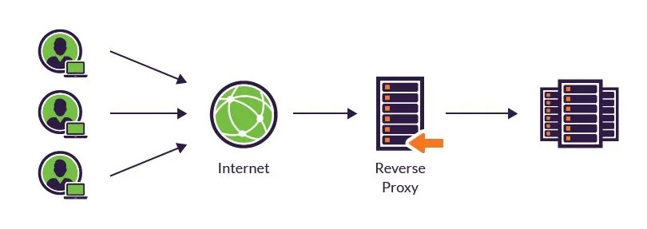

# Tutorial: Setting Up a CI/CD Pipeline with GitHub Actions and Docker

## Introduction and overview

On 3rd semester we will guide you through creating a CI/CD pipeline for a Java / Javalin project using GitHub Actions, Docker Hub, Watchtower and Docker. You will learn how to automate the building, testing, and deployment of your application in a containerized environment and run it on a Digital Ocean server.

The illustration at your left shows the full pipeline. Please read these descriptions carefully in order to understand the steps included in the pipeline.

{: .x mx-auto .d-block .my-5 .md .d-md-none }
{: .d-none .d-md-inline-block .ml-3 .mb-5 .float-right}

1. Programming the project: You will write the code for your project in Java 17 and Javalin on your local machine. In this semester we will use Javalin as the web framework, and we build RESTful APIs. The projects are built using Maven, and the structure of the project is based on the Maven standard. So you will have a `src/main/java` folder for your Java code, and a `src/main/resources` folder for your resources. You will also have a `src/test/java` folder for your tests. The `pom.xml` file will be the configuration file for Maven, and we need to include a `Dockerfile` that describes how to build an image with the project in step (5). We also need to include a file for Github Actions in the `.github/workflows` folder. This file will describe the steps in the pipeline.
2. The Github Actions is setup to tigger a deployment build when you **push** to the main branch. The pipeline will build the project, run the tests, build a Docker image, push the image to Docker Hub. Later on, Watchtower will pull the image from Docker Hub and run it on a Digital Ocean server. This is why we advocate for using pull requests and feature branches. This way you can test your code before merging it into the main branch - where the pipeline is triggered.
3. The Github Repo needs to be configured with a Docker Hub name and secret. These are needed for authenticating the pipeline when pushing the Docker image to Docker Hub.
4. When the main branch is pushed, the pipeline will be triggered.
5. You can follow the process in the Actions tab on your Github repository. In case the build fails, you will get a notification in the Actions tab. You will also be able to inspect the build logs to see what went wrong.
6. When the build is successful, the Docker image is pushed to Docker Hub. You can inspect the image in your Docker Hub account.
7. Docker Hub is used for storing your Docker images. You can see the images in your Docker Hub account. Each image has a tag that corresponds to the commit hash in your Github repository. This way you can always trace back to the code that was used to build the image.
8. The new built Docker image is not pushed to the Digital Ocean server. Instead, when the `docker compose up` is executed, the image is pulled from Docker Hub.
9. Watchtower is configured to pull the image from Docker Hub at specific time intervals and run it on the server. This way you can deploy your application to the cloud. Watchtower will also restart the container if it crashes. Check how to [setup Watchtower](./watchtower.md) for more details.
10. The Docker container will run your Javalin project on a specific port. At the next deployment, Watchtower will pull the new image and run it in a new container and retire the old one. This way you can deploy new versions of your project without downtime at all.
11. The application is accessed through the http protocol by using a port number.  We will go into more details on how to setup **Caddy Server** to handle the **domain** and **SSL certificates** in the next exercise called [Caddy Setup](./caddy_setup.md). Caddy also acts as a reverse proxy server and static file server.

A reverse proxy accepts a request from a client, forwards it to a server that can fulfill it, and returns the server’s response to the client.

