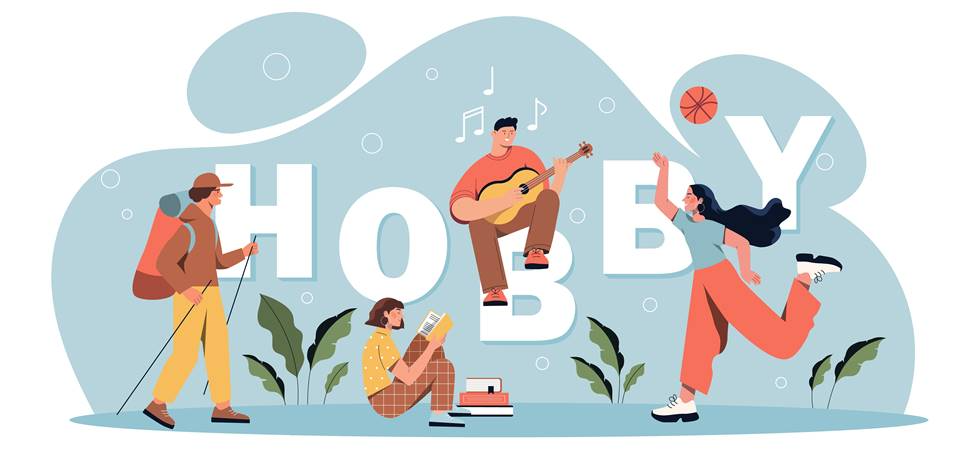

# Course Assignment 1 (SP-1)

## Introduction

> The business idea is to create a platform that not only provides information about people and their hobbies but also offers a matchmaking service. Users can input their hobbies and interests, and the platform can connect them with like-minded individuals or groups in their local area. This would add a social networking element to the service and encourage people to explore new hobbies together, fostering real-world connections.

This business idea is one of many you can think of. There are, however, a few restrictions that you must adhere to.
For instance, users who register must be able to enter their hobbies, phone number and ultimately their full address in their profile. Of course, the user stories mentioned below must also play into your considerations.

Once you have decided on your version of the business idea, your next step will be to develop a `domain model`. This will make it easier for you to keep an overall perspective of your business plan. Conceptional a domain model is a representation of the
problem domain (the subject area the software deals with). It defines the entities, their attributes, and how they relate to each other in the real-world context.

The last step is to create a diagram that mirrors your future database, also known as an EER diagram.

Your Domain Model and EER diagram will be the foundation for your data model and the JPA entities you will later create. Both
diagrams, including a description, your business idea and your complete user stories should be added to your README.md file.

Happy coding!

## User Stories

- [US-1] As a user I want to get all the information about a person
- [US-2] As a user I want to get all phone numbers from a given person
- [US-3] As a user I want to get all persons with a given hobby
- [US-4] As a user I want to get the number of people with a given hobby
- [US-5] As a user I want to get a list all hobbies + a count of how many are interested in each hobby
- [US-6] As a user I want to get all persons living in a given city (i.e. 2800 Lyngby)
- [US-7] As a user I want to get a list of all postcodes and city names in Denmark
- [US-8] As a user I want to get all the information about a person (address, hobbies etc) given a phone number
- [US-9] As a user I want to be able to do CRUD operations on all JPA entities unless it wouldn't make sense for a given entity.
- [US-10] … Add more meaningful services of your own choice.

### Project Requirements

- [R-1] The project must include the following technologies
    - JPA
    - JPQL
    - Maven
    - JDK 17^
    - JUnit 5
    - Docker
    - PostgresSQL
    - pgAdmin
    - Lombok
- [R-2] The project must contain a meaningful EER-diagram (use pgAdmin to create the diagram)
- [R-3] The project must be documented in a README.md file(*)
- [R-4] The project must contain meaningful unit tests. (70 - 80 % of the methods must be tested (DAO, Entity ...))
- [R-5] JPA annotations must be used for mapping domain classes
- [R-6] JPQL must be used for all CRUD operations
- [R-7] JPA annotations must include minimum once an @Enumerated, @PrePersist, @PreUpdate and @Temporal tag.
- [R-8] The phone number as to follow the Danish rules for phone numbers (e.g. +45 12345678)
- [R-9] If you use a Date property in an entity, it must be a java.time.LocalDate or java.time.Date and not just a String
- [R-10] DAO classes should follow the Singleton Pattern

### Optional Requirements

- [OPT-1] 100 % CRUD coverage for all entities
- [OPT-2] 100 % test coverage of all DAO classes.
- [OPT-3] Create a method that you could use later in connection with pagination (e.g. a method that returns a list of persons given a page number and a page size)
- [OPT-4] Provide a search functionality that allows users to filter and find others based on various criteria, such as location, age, or common hobbies.

### README.md

The Readme.md file must contain the following:

- [R-3] A description of your business idea
- [R-3] An Domain Model of your business idea
- [R-3] An EE-diagram of your database
- [R-3] A group description of your group work and how you have collaborated (GIT, Trello, Discord, who did what, etc.)
- [R-3] All technical requirements listed above under Project Requirements

### Hand-in
The project must be handed in on [Moodle as a link to a git-repo](https://cphbusiness.mrooms.net/mod/assign/view.php?id=621503) containing the full source code incl. unit tests. Latest Thursday before midnight.

### Resources

The links below are just suggestions for data initialization. You are free to use other resources.

- [Zip codes and city names for Denmark - sql init](./zipcodes.md)
- [Hobbies - sql init](./hobbies.md)
- Alternatively and more challenging can the data for City Info be requested from the following API:
- [Dataforsyning](https://api.dataforsyningen.dk/postnumre)