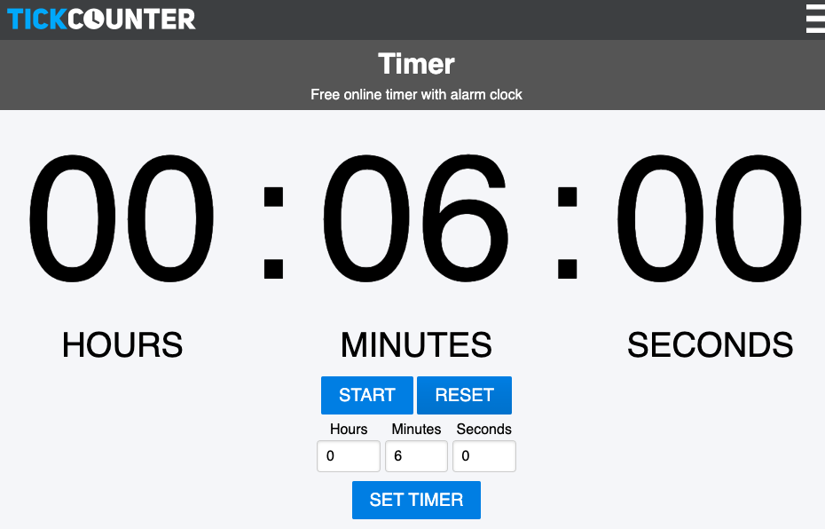
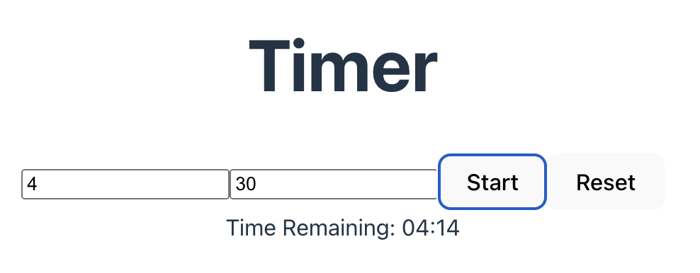

# React: Tick Counter

Often when we have breaks during a teaching session, we use this [Tick Counter](https://www.tickcounter.com/timer) for timing the duration of the break. 



We can do that better!

Please implement an updated version, that will match these requirements:

1. We only need minutes and seconds.
2. We should be able to enter minutes and seconds like on the mockup
3. There should be two buttons: `Start` and `Reset`. As soon as the `Start` is pressed, the timer should begin to count down. `Reset` will stop the timer, and set minutes and seconds to zero.

The first prototype might look as simple as this:



4. Add a `Pause` button that stops the timer until `Start` is pressed again. An even better implementation would be that `Start` changes to `Pause` when clicked, and `Pause` changes to `Start`.

5. Add some short cut buttons with pre-set timers. One for 5 minutes, one for 10, and one for 15 minutes. These are usually the standard break times. The timer should begin counting down as soon as the short cut timer button is clicked.

## Hints

- Consider how to save the time, minutes and seconds. A useState holding an integer for each would probably be good.

- You should be able to stop and start the timer, so a boolean useState for that would also be recommended.

- The timer can be activated and set into motion by using the Javascript `setInterval` function, setting the timer to 1000ms. This should be handled in a `useEffect` hook.

- Create Javascript function to start the timer (`startTimer()`) and to reset the timer (`resetTimer`).

- The UI (basic format) could be implemented as this:

  ```javascript
  return (
    <div>
      <div>
        <input
          type="number"
          placeholder="Minutes"
          value={minutes}
          onChange={(e) => setMinutes(parseInt(e.target.value))}
        />
        <input
          type="number"
          placeholder="Seconds"
          value={seconds}
          onChange={(e) => setSeconds(parseInt(e.target.value))}
        />
        <button onClick={startTimer}>Start</button>
        <button onClick={resetTimer}>Reset</button>
      </div>
      <div>Time Remaining: {formatTime(time)}</div>
    </div>
  );
  ```

The `setMinutes` and `setSeconds` are updating the useStates `minutes` and `seconds`.

Good luck - and make us proud!
